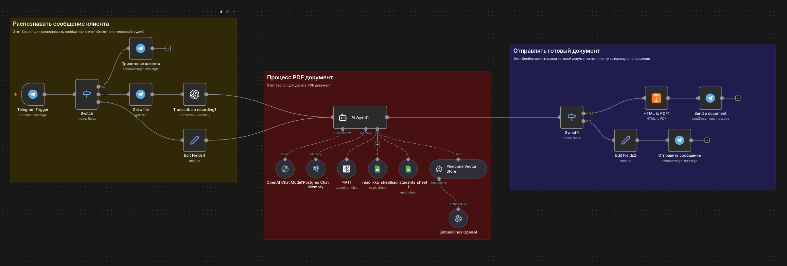

# 📚 Mugalim AI Assistant (Teacher's Bot)
**@ai_mugalim_zhambyl_bot**

## 🎯 Description
This is an automated Telegram bot designed to assist teachers in Kazakhstan. It helps reduce administrative workload by generating documents automatically and providing professional consultation regarding certification (attestation) and methodology.

## ✨ Key Features
* **AI Consultation:** Answers questions about teaching methods and laws using a Vector Database (RAG).
* **Document Generation:** Creates PDF documents (e.g., KKP/Lesson Plans) automatically.
* **Database Integration:** Fetches student/teacher data from Google Sheets.
* **Multilingual Support:** Supports Kazakh and Russian languages.

## 🛠 Tech Stack & Workflow
* **Orchestrator:** n8n
* **LLM:** OpenAI (GPT-4o mini)
* **Vector Database:** Pinecone (for Knowledge Base)
* **Interface:** Telegram Bot API
* **Tools:** HTML-to-PDF, Google Sheets API, Serper Dev (Search).

## 🚀 How it Works (Workflow Logic)
1.  **Trigger:** User sends a message in Telegram.
2.  **Classification:** The AI Agent determines if the user needs *advice* or a *document*.
3.  **Scenario A (Advice):** Queries Pinecone Vector Store -> Generates text answer.
4.  **Scenario B (Document):** Fetches template -> Fills data from Sheets -> Converts HTML to PDF -> Sends file.

## 📦 Installation
1.  Import the `workflow.json` file into your n8n instance.
2.  Set up credentials for: Telegram, OpenAI, Pinecone, Google Sheets.
3.  Activate the workflow.

## 👨‍💻 Author
Nurassyl Mukhambetaly
